# Project Program Sederhana

## Program Tempratur Suhu

## Penjelasn

### Langkah 1
Menggunakan import re untuk mengimport dan menvalidasi input yang dimasukkan pengguna:
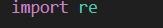

### Langkah 2
Class Data berfungsi untuk menyimpan dua atribut yakni nilai suhu dan satuan suhu. penggunaan _init_ untuk menginialisasi suhu dan satuan dengan nilai awal none/masih kosong. set_suhu untuk menyimpan nilai suhu dan satuannya. menggunakan get_suhu dan get_satuan yang berfungsi untuk mengakses dan mengembalikan nilai suhu dan satuan suhu yang disimpan.:
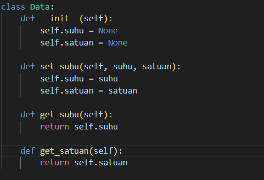

### Langkah 3
Class Process bertanggung jawab dalam menangani proses konversi suhu dari satuan ke satuan lainnya. _init_(self, data): untuk menerima menerima objek dari Class Data. konversi(self) berfungsi untuk mengecek satuan suhu dan memberi metode konversi yang akan digunakan. if dan elif untuk menentukan method program.:
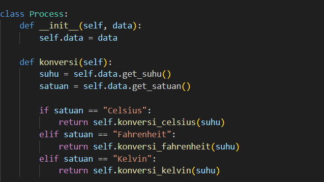

konversi_celsius berfungsi mengonversi suhu dari celsius ke fahrenheit dan kelvi dengan rumusa yang sudah ditentukan. konversi_fahrenheit berfungsi mengonversi suhu dari fahrenheiit ke celsius dan kelvi dengan rumusa yang sudah ditentukan. konversi_kelvin berfungsi mengonversi suhu dari kelvin ke fahrenheit dan celsius dengan rumusa yang sudah ditentukan.:
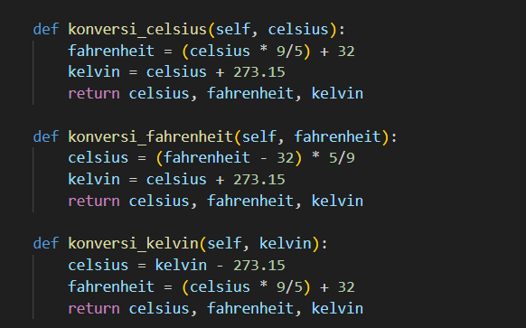

### Langkah 4 
Class View bertanggung jawab dalam menampilkan hasil proses berupa tabel. tampilkan_tabel berisi suhu awal, satuan awal, suhu celsius, suhu fahrenheit, dan suhu kelvin. lalu print:
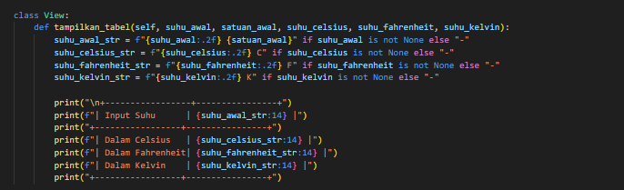

### Langkah 5
Class IputValidator bertanggung jawab dalam memvalidasi input suhu dan satuan suhu. •	validasi_input bertugas untuk mengecek apakah input suhu itu berupa angka. validasi_satuan bertugas mengecek apakah input satuan berupa satuan suhu.:
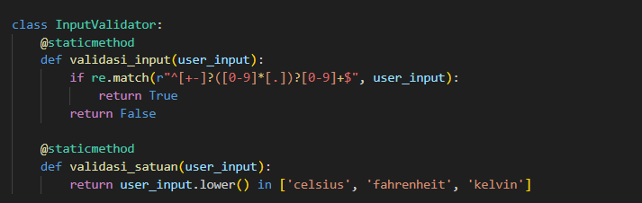

### Langkah 6
def main() bertugas untuk mengatur jalannya program dari input sampai hasil konversi. whlie true untuk mengulang input dari nilai suhu dan satuan suhu. if jika benar akan divalidasi, lalu break berhenti. else jika input salah. print "satuan/suhu tidak valid">:
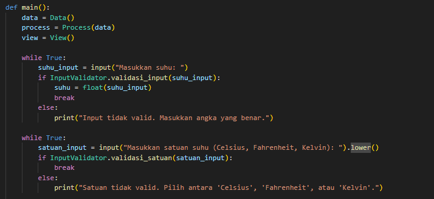

Set suhu dan satuan berfungsi Memanggil set_suhu() pada objek Data untuk menyimpan input.
Konversi suhu berfungsi Memanggil konversi() pada objek Process untuk mendapatkan hasil konversi suhu.
Tampilkan hasil berfungsi Memanggil tampilkan_tabel() pada objek View untuk mencetak hasil konversi dalam format tabel.:
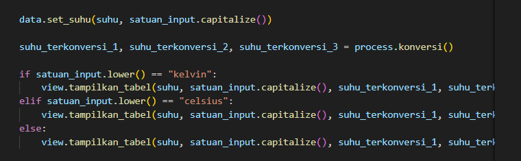

Memastikan bahwa fungsi main() hanya dijalankan ketika file tersebut dijalankan langsung,:
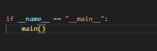

### hasil eksekusi
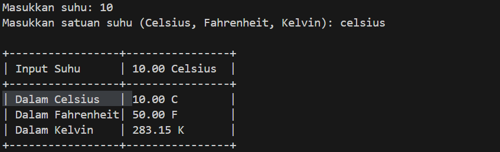

jika error
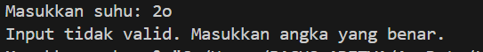

## Kesimpulan
Program ini dibuat untuk mengukur suhu celsius, fahrenheit, dan kelvin dengan menggunakan class data, class process, class view, dan class validator dengan pendekatan OOP dan modular. Program konversi suhu ini contoh program sederhana tetapi berjalan dengan efektif berdasarkan konsep OOP. Dengan memanfaatkan validasi input, struktur modular, dan pemrosesan yang efisien.

## Link video
https://youtu.be/yk4hJfBpKA0 